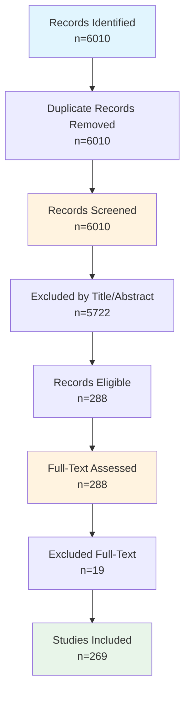

# Systematic Review Findings Report

**Date:** March 14, 2026
**Review Protocol:** PRISMA 2020 Guidelines

---

## Executive Summary

This systematic review identified **269 studies** meeting inclusion criteria. 
The review followed PRISMA 2020 guidelines and covered the period 2025-2026. 
The studies were sourced from multiple databases, focusing on blockchain-enabled provenance for scientific data management.

---

## 1. PRISMA Flow Diagram

### 1.1 Flow Statistics

| Stage | Count | Percentage |
|-------|-------|------------|
| Records identified | 6010 | 100% |
| After duplicates removed | 6010 | 100% |
| Screened | 6010 | 100% |
| Excluded at title/abstract | 5722 | 95.2% |
| Assessed for full-text | 288 | 4.8% |
| Excluded at full-text | 19 | 6.6% |
| **Studies included** | **269** | **4.5%** |

### 1.2 Mermaid Flowchart

### 1.3 Exclusion Reasons

| Reason | Count |
|--------|-------|
| Wrong topic (technical implementation) | 0 |
| Wrong topic (domain relevance) | 0 |
| Opinion piece | 0 |
| Non-research context | 0 |

---

## 2. Methods

### 2.1 Search Strategy

This systematic review searched the following databases: IEEE Xplore, Scopus, Web of Science, PubMed, ACM Digital Library. 
Search strings were developed following PRISMA 2020 guidelines using a title-focused strategy targeting the intersection of:

- **maDMP/Provenance:** machine-actionable, maDMP, data management, DMP, provenance, data lineage, chain of custody, verification
- **Technology:** platform, repository, storage, blockchain, IPFS, decentralized
- **Scientific Context:** scientific data, research data, open science, metadata, PROV-O, semantic, FAIR, reproducibility

Date range: 2020-2026. Search focused on Title field for higher precision.

### 2.2 Eligibility Criteria

| Criterion | Description |
|-----------|-------------|
| Language | English |
| Publication type | Journal articles, conference papers, preprints |
| Date range | 2025-2026 |
| Topic | Blockchain/DLT for scientific data provenance |
| Domain | Research data management, data sharing, reproducibility |

### 2.3 Screening Process

1. Records imported from databases and duplicates removed
2. Title and abstract screening using automated keyword-based eligibility criteria
3. Full-text assessment for all included records
4. Data extraction for included studies
5. Quality assessment using Mixed Methods Appraisal Tool (MMAT)

### 2.4 Data Extraction

Extracted variables include: Research focus, Blockchain platform, Provenance model, maDMP support, Evaluation method, Storage integration, Permission model.

### 2.5 Quality Assessment

Quality was assessed using the MMAT with five criteria: Clear research questions, Appropriate methodology, Rigorous data collection, Sound analysis, and Well-supported conclusions.

---

## 3. Study Characteristics

### 3.1 Distribution by Research Focus (n=269)

| Research Focus | Count |
|------------|------|
| Blockchain | 1 |
| Other | 200 |
| Provenance | 67 |
| maDMP | 1 |

### 3.2 Distribution by Blockchain Platform

| Platform | Count |
|------------|------|
| Ethereum | 17 |
| Ethereum; Hyperledger | 5 |
| Hyperledger | 1 |
| Hyperledger Fabric; Ethereum; Hyperledger | 2 |
| Hyperledger Fabric; Hyperledger | 9 |
| Not specified | 235 |

### 3.3 Distribution by Provenance Model

| Model | Count |
|------------|------|
| None | 269 |

### 3.4 Distribution by maDMP Support

| maDMP Support | Count |
|------------|------|
| None | 269 |

### 3.5 Distribution by Evaluation Method

| Evaluation Method | Count |
|------------|------|
| Experiment; Proof of concept | 1 |
| Not clear | 267 |
| Proof of concept | 1 |

### 3.6 Publication Year Distribution

| Year | Count |
|------------|------|
| 2025 | 230 |
| 2026 | 39 |

---

## 4. Detailed Analysis

### 4.1 Top Publication Sources (Journals/Conferences)

| Source | Count |
|--------|-------|
| Lecture Notes in Networks and Systems | 18 |
| Communications in Computer and Information Science | 5 |
| Lecture Notes in Computer Science | 5 |
| Lecture Notes in Computer Science (including subseries Lecture Notes in Artificial Intelligence and Lecture Notes in Bioinformatics) | 4 |
| CEUR Workshop Proceedings | 3 |
| IEEE Access | 3 |
| International Journal of Advanced Computer Science and Applications | 3 |
| Studies in Health Technology and Informatics | 3 |
| 2025 7th International Conference on Blockchain Computing and Applications, BCCA 2025 | 2 |
| 2025 International Conference on Emerging Technologies in Engineering Applications, ICETEA 2025 - Proceedings | 2 |

### 4.2 Storage Integration Patterns

| Storage Type | Count |
|------------|------|
| External DB | 36 |
| External DB; Hybrid | 8 |
| Hybrid | 13 |
| IPFS | 2 |
| IPFS + blockchain | 18 |
| IPFS + blockchain; External DB | 9 |
| IPFS + blockchain; External DB; Hybrid | 1 |
| IPFS + blockchain; Hybrid | 2 |
| Not specified | 180 |

### 4.3 Permission Model Distribution

| Permission Model | Count |
|------------|------|
| Hybrid | 22 |
| Not specified | 237 |
| Permissioned | 2 |
| Permissioned; Hybrid | 1 |
| Permissionless | 6 |
| Permissionless; Hybrid | 1 |

### 4.4 Cross-Tabulation: Blockchain Platform × Provenance Model

| Platform | 
None
 |
|----------|
---
|
| Ethereum | 17 |
| Ethereum; Hyperledger | 5 |
| Hyperledger | 1 |
| Hyperledger Fabric; Ethereum; Hyperledger | 2 |
| Hyperledger Fabric; Hyperledger | 9 |
| Not specified | 235 |

### 4.5 Systems/Frameworks Identified

| System/Framework | Mentions |
|------------------|----------|
| Hyperledger Fabric | 1 |
| NA | NA |
| NA | NA |
| NA | NA |
| NA | NA |
| NA | NA |
| NA | NA |
| NA | NA |
| NA | NA |
| NA | NA |

---

## 5. Quality Assessment

### 5.1 Quality Ratings Distribution

| Rating | Description | Count |
|--------|-------------|-------|
| Excellent | Score 5 - clear methodology, rigorous evaluation | 
0
 |
| Good | Score 4 - minor methodological gaps | 
91
 |
| Acceptable | Score 3 - some concerns | 
178
 |
| Poor | Score 2 - significant gaps | 
0
 |
| Very Poor | Score 1 - cannot assess | 
0
 |

**Mean Quality Score:** 0.62 / 1.0
**Mean Rating (1-5):** 3.34 / 5.0

### 5.2 MMAT Item Scores

| MMAT Item | Yes | Can't tell | Rate |
|-----------|-----|------------|------|
| Clear Research Questions | 
5
 | 
264
 | 
1.9
% |
| Appropriate Methodology | 
115
 | 
154
 | 
42.8
% |
| Rigorous Data Collection | 
0
 | 
269
 | 
0
% |
| Sound Analysis | 
204
 | 
65
 | 
75.8
% |
| Well-supported Conclusions | 
0
 | 
269
 | 
0
% |

**Quality Scale (per Protocol Section 8.2):** 5 = Excellent, 4 = Good, 3 = Acceptable, 2 = Poor, 1 = Very Poor

---

## 6. Thematic Synthesis

### 6.1 Research Themes Identified

| Theme | Description | Studies |
|-------|-------------|---------|
| Blockchain Infrastructure | Papers focusing on blockchain platforms, DLT architecture | 
1
 |
| Provenance Tracking | Papers on data lineage, verification, chain of custody | 
67
 |
| maDMP | Papers on machine-actionable data management plans | 
1
 |
| Combined Approach | Papers addressing multiple themes | 
0
 |

### 6.2 Technical Architecture Patterns

| Pattern | Description | Count |
|---------|-------------|-------|
| Permissioned Blockchain | Systems using Hyperledger Fabric/Iroha | 
11
 |
| Permissionless Blockchain | Systems using Ethereum/public chains | 
24
 |
| PROV-O Based | Systems using W3C PROV ontology | 
0
 |
| Custom Provenance | Systems with proprietary provenance models | 
0
 |

---

## 6. Included Studies

| Study_ID | Title | Year | Authors | Source | Research_Focus | Blockchain_Platform | Provenance_Model | maDMP_Support | Evaluation_Method |
| --- | --- | --- | --- | --- | --- | --- | --- | --- | --- |
| REV001 | Research Trends and Emerging Themes o... | 2025 | Qiu Vivian Yifei and Tse Alex Wing Ch... | Proceedings of the 2024 16th Internat... | Other | Not specified | None | None | Not clear |
| REV002 | Centralization in the Decentralized W... | 2025 | Shi Ruizhe and Cheng Ruizhi and Fu Yu... | Proceedings of the ACM on Web Confere... | Other | Not specified | None | None | Not clear |
| REV003 | Analysis of Web3 Platform Data Manage... | 2026 | Shi Jianzheng and Wang Yue and Ow Ter... | Distrib. Ledger Technol. | Other | Not specified | None | None | Not clear |
| REV004 | Library resource sharing system and d... | 2025 | Sun Yuheng and Zhou Wei and Deng Lin ... | Proceedings of the 2024 3rd Internati... | Other | Not specified | None | None | Not clear |
| REV005 | Design of Educational Data Management... | 2025 | Hata Yudai and Sakurai Kouichi et al. | Proceedings of the 2024 5th Internati... | Other | Not specified | None | None | Not clear |
| REV006 | Mantle: Efficient Hierarchical Metada... | 2025 | Li Jiahao and Cao Biao and Jian Jielo... | Proceedings of the ACM SIGOPS 31st Sy... | Other | Not specified | None | None | Not clear |
| REV007 | AutoBench: A Holistic Platform for Au... | 2025 | Parab Arjun and Raoofy Amir and Sp\"o... | Companion of the 16th ACM/SPEC Intern... | Other | Not specified | None | None | Not clear |
| REV008 | Reproducibility Report for ACM SIGMOD... | 2026 | Deng Yangshen and Fruth Michael and S... | Reproducibility Reports of the 2025 I... | Provenance | Not specified | None | None | Not clear |
| REV009 | CP2GS: Cross-Platform Provenance Gene... | 2025 | Zhang Zilong and Dong Weiyu and Li Zh... | Proceedings of the 2025 4th Internati... | Provenance | Not specified | None | None | Not clear |
| REV010 | A Blockchain-based System for Dataset... | 2025 | Galletta Antonino and Branca Salvator... | Proceedings of the 6th Workshop on Se... | Provenance | Not specified | None | None | Not clear |
| REV011 | A Neuro-Symbolic and Blockchain-Enhan... | 2026 | Zhang Tiantian et al. | Proceedings of the 2025 International... | Other | Not specified | None | None | Not clear |
| REV012 | SrFTL: Leveraging Storage Semantics f... | 2025 | Zhu Weidong and Hernandez Grant and G... | ACM Trans. Storage | Other | Not specified | None | None | Not clear |
| REV013 | AI-Enhanced Blockchain Networks for C... | 2025 | Gupta Shubham and Vanteru Kusumakumar... | Proceedings of the 2025 4th Internati... | Provenance | Not specified | None | None | Not clear |
| REV014 | A FAIR Public Permissioned Blockchain... | 2025 | Daoulas Christos and Sacharidis Dimit... | Proceedings of the 8th ACM SIGSPATIAL... | Other | Not specified | None | None | Not clear |
| REV015 | The BigFAIR Architecture: Enabling Bi... | 2025 | Castro Jo\~ao Pedro de Carvalho and M... | J. Data and Information Quality | Other | Not specified | None | None | Not clear |
| REV016 | Accelerating Verifiable Queries over ... | 2025 | Hua Yifan and Zheng Shengan and Kong ... | ACM Trans. Archit. Code Optim. | Other | Ethereum | None | None | Not clear |
| REV017 | Performance Characterization and Prov... | 2025 | Gueroudji Amal and Phelps Chase and I... | Proceedings of the SC '24 Workshops o... | Provenance | Not specified | None | None | Not clear |
| REV018 | Measuring While Playing Fair: An Empi... | 2025 | Magin Florian and Scherf Fabian and R... | Proceedings of the 2025 Workshop on S... | Other | Not specified | None | None | Not clear |
| REV019 | Optimizing the Performance of NDP Ope... | 2025 | Li Lin and Chen Xianzhang and Li Jial... | Proceedings of the 60th Annual ACM/IE... | Other | Not specified | None | None | Not clear |
| REV020 | Secure and Scalable Data Integrity Ve... | 2025 | S. Das; M. Mishra; R. Priyadarshini e... | 2025 IEEE 6th India Council Internati... | Provenance | Not specified | None | None | Not clear |
| REV021 | Blockchain-Enhanced Chain of Custody ... | 2025 | R. Mishra; P. Arya; M. Narwaria; I. K... | 2025 IEEE International Conference on... | Provenance | Not specified | None | None | Not clear |
| REV022 | GalaxyQ: A Platform for Reproducible ... | 2025 | B. Raubenolt; D. Blankenberg et al. | 2025 IEEE International Conference on... | Provenance | Not specified | None | None | Not clear |
| REV023 | Decentralized Provenance Metadata Reg... | 2025 | T. Hardjono; D. Avrilionis et al. | 2025 IEEE International Conference on... | Provenance | Not specified | None | None | Not clear |
| REV024 | Research on the Construction of Scien... | 2025 | S. Yang; Y. Liu; J. Meng; B. Li et al. | 2025 IEEE 12th Joint International In... | Other | Not specified | None | None | Not clear |
| REV025 | Blockchain for e-healthcare: a review... | 2026 | Khan et al. | Journal of Big Data | Other | Ethereum; Hyperledger | None | None | Not clear |
| REV026 | Identification of biomedical entities... | 2026 | Kaier et al. | BMC Research Notes | Other | Not specified | None | None | Not clear |
| REV027 | Reconstruction of the Age of Provenan... | 2026 | Chefranova et al. | Doklady Earth Sciences | Provenance | Not specified | None | None | Not clear |
| REV028 | A blockchain-based healthcare archite... | 2026 | T F et al. | Sustainable Computing: Informatics an... | Other | Not specified | None | None | Not clear |
| REV029 | Long-Term Field Experiments Overview ... | 2026 | Dönmez et al. | Computers and Electronics in Agriculture | Other | Not specified | None | None | Experiment; Proof of concept |
| REV030 | BLOCKCHAIN AND AI IN ART PROVENANCE T... | 2026 | Arsalwad et al. | ShodhKosh: Journal of Visual and Perf... | Provenance | Not specified | None | None | Not clear |
| REV031 | Deterministic protein structure and b... | 2026 | Kanu et al. | ICT Express | Provenance | Not specified | None | None | Not clear |
| REV032 | BMSES: Blockchain and mobile edge com... | 2026 | Hasan et al. | Journal of Parallel and Distributed C... | Other | Not specified | None | None | Not clear |
| REV033 | Fair Consensus in Blockchain-Dual Sam... | 2026 | Vijaya Vardan Reddy et al. | International Journal of Communicatio... | Other | Not specified | None | None | Not clear |
| REV034 | A Provenance Chain for Decentralized ... | 2026 | Reif et al. | AIAA Science and Technology Forum and... | Provenance | Not specified | None | None | Not clear |
| REV035 | Neurosynth Compose: A web-based platf... | 2026 | Kent et al. | Imaging Neuroscience | Other | Not specified | None | None | Not clear |
| REV036 | SAHChain: A Hybrid Storage Blockchain... | 2026 | Qin et al. | IEEE Transactions on Computers | Other | Ethereum | None | None | Not clear |
| REV037 | Enabling metadata enrichment of 3D me... | 2026 | Geiger et al. | Procedia CIRP | Other | Not specified | None | None | Not clear |
| REV038 | Bridging the Data Discovery Gap: User... | 2026 | Wu et al. | Data Science Journal | Other | Not specified | None | None | Not clear |
| REV039 | Verification and Analysis of Phase Ad... | 2026 | B.; Feng et al. | Lecture Notes in Civil Engineering | Provenance | Not specified | None | None | Not clear |
| REV040 | How User-Generated Content and Platfo... | 2026 | Lo et al. | Journal of Consumer Behaviour | Other | Not specified | None | None | Not clear |
| REV041 | The agnostics way platform for data g... | 2026 | Patil et al. | International Journal of Wireless and... | Other | Not specified | None | None | Not clear |
| REV042 | Blockchain-Based Data Integrity and P... | 2026 | Venugopal et al. | Analytical Letters | Provenance | Not specified | None | None | Not clear |
| REV043 | VeriCert: SSL/TLS Certificate Verific... | 2026 | Giuliani et al. | Lecture Notes of the Institute for Co... | Provenance | Not specified | None | None | Not clear |
| REV044 | RedactChain: A Redactable Blockchain-... | 2026 | Sharma et al. | Lecture Notes in Networks and Systems | Other | Not specified | None | None | Not clear |
| REV045 | A Comprehensive Analysis of Intellige... | 2026 | Jain et al. | Lecture Notes in Networks and Systems | Other | Not specified | None | None | Not clear |
| REV046 | Leveraging AI and Blockchain Technolo... | 2026 | Kulkarni et al. | Lecture Notes in Networks and Systems | Other | Not specified | None | None | Not clear |
| REV047 | Blockchain-Enhanced KYC: A Secure and... | 2026 | Sambare et al. | Lecture Notes in Networks and Systems | Provenance | Not specified | None | None | Not clear |
| REV048 | The Evolution of Patient Data Managem... | 2026 | Sharma et al. | Lecture Notes in Networks and Systems | Other | Not specified | None | None | Not clear |
| REV049 | A Blockchain-Based Efficient Verifica... | 2026 | Bao et al. | Computers, Materials and Continua | Provenance | Not specified | None | None | Not clear |
| REV050 | Linking SysMLv2 with Systems Platform... | 2026 | Strobbe et al. | IFIP Advances in Information and Comm... | Provenance | Not specified | None | None | Not clear |
| REV051 | Blockchain Driven Generative AI: Ensu... | 2026 | Alam et al. | Lecture Notes in Networks and Systems | Provenance | Not specified | None | None | Not clear |
| REV052 | A Blockchain-Enabled Secure and Scala... | 2026 | Patil et al. | Lecture Notes in Networks and Systems | Provenance | Hyperledger Fabric; Hyperledger | None | None | Not clear |
| REV053 | A Self-sovereign Identity Framework U... | 2026 | Garrido-Fúnez et al. | Lecture Notes in Computer Science | Other | Not specified | None | None | Not clear |
| REV054 | Byzantine-resistant model verificatio... | 2026 | Dai et al. | Applied Soft Computing | Provenance | Not specified | None | None | Not clear |
| REV055 | SD-ATD: Semantic-Decoupling Contrasti... | 2026 | Guo et al. | Communications in Computer and Inform... | Other | Not specified | None | None | Not clear |
| REV056 | Semantic-driven seasonal data classif... | 2026 | Yuan et al. | Engineering Applications of Artificia... | Other | Not specified | None | None | Not clear |
| REV057 | An Empirical Study of Variation of Bl... | 2026 | Biswas et al. | Lecture Notes in Computer Science | Provenance | Ethereum | None | None | Not clear |
| REV058 | Fine-scale provenance variability dur... | 2026 | Kang et al. | Gondwana Research | Provenance | Not specified | None | None | Not clear |
| REV059 | Decentralized Research Data Sharing M... | 2026 | Hylli et al. | Communications in Computer and Inform... | Other | Not specified | None | None | Not clear |
| REV060 | BarBeR - Barcode Benchmark Repository... | 2026 | Vezzali et al. | Lecture Notes in Computer Science | Provenance | Not specified | None | None | Not clear |
| REV061 | Decentralized Blockchain Framework fo... | 2025 | Maksymyuk et al. | International Journal of Computing | Provenance | Not specified | None | None | Not clear |
| REV062 | Verification and reproducible curatio... | 2025 | Smith et al. | PLOS Computational Biology | Provenance | Not specified | None | None | Not clear |
| REV063 | A Lightweight Decentralized Medical D... | 2025 | Zhang et al. | Cryptography | Provenance | Not specified | None | None | Not clear |
| REV064 | A privacy preserving medical data man... | 2025 | Taloba et al. | Scientific Reports | Other | Not specified | None | None | Not clear |
| REV065 | EmbryoTrust: A Blockchain-Based Frame... | 2025 | Alsalamah et al. | Electronics (Switzerland) | Other | Ethereum | None | None | Not clear |
| REV066 | Semantic data sharing and pricing in ... | 2025 | Sitharamulu et al. | Discover Computing | Other | Not specified | None | None | Not clear |
| REV067 | Tubeless Insulin Pump Combined with a... | 2025 | Jeandidier et al. | Diabetes Therapy | Other | Not specified | None | None | Not clear |
| REV068 | FogChainFlow: On-off blockchain data ... | 2025 | Karthikeyan et al. | Cluster Computing | Other | Not specified | None | None | Not clear |
| REV069 | Enhancing structural health monitorin... | 2025 | Mariniello et al. | Automation in Construction | Other | Not specified | None | None | Not clear |
| REV070 | Enhancing mental health outcomes thro... | 2025 | Mugotitsa et al. | BMC Health Services Research | Other | Not specified | None | None | Not clear |
| REV071 | The systematic assessment of complete... | 2025 | Huang et al. | Genome Biology | Other | Not specified | None | None | Not clear |
| REV072 | An LLM-guided platform for multi-gran... | 2025 | Gregori et al. | Journal of Big Data | Provenance | Not specified | None | None | Not clear |
| REV073 | Towards fair decentralized benchmarki... | 2025 | Zenk et al. | Nature Communications | Other | Not specified | None | None | Not clear |
| REV074 | User-Centric Data Management in Decen... | 2025 | Zhang et al. | IEEE Wireless Communications | Other | Not specified | None | None | Not clear |
| REV075 | Volcanoes to vugs: Demonstrating a FA... | 2025 | Nixon et al. | Chemical Geology | Other | Not specified | None | None | Not clear |
| REV076 | SEARS: a lightweight FAIR platform fo... | 2025 | Tali et al. | Digital Discovery | Other | Not specified | None | None | Not clear |
| REV077 | Protecting metadata privacy in blockc... | 2025 | Tousi Saeidi et al. | Journal of Information Security and A... | Other | Not specified | None | None | Not clear |
| REV078 | Implementing XRootD/SciToken-Based Ac... | 2025 | Spreckels et al. | EPJ Web of Conferences | Other | Not specified | None | None | Not clear |
| REV079 | Blue-cloud DAB: developing a platform... | 2025 | Boldrini et al. | International Journal of Data Science... | Other | Not specified | None | None | Not clear |
| REV080 | Exploring Blockchain-Based Informatio... | 2025 | Kumar et al. | Indian Journal of Information Sources... | Other | Not specified | None | None | Not clear |
| REV081 | Self-Sovereign Identities and Content... | 2025 | Farhan et al. | Future Internet | Provenance | Ethereum; Hyperledger | None | None | Not clear |
| REV082 | Blockchain-Enhanced Deep Learning Fra... | 2025 | Srivastava et al. | Cognitive Computation | Other | Not specified | None | None | Not clear |
| REV083 | Semantic-enriched framework for async... | 2025 | Rehman et al. | Automation in Construction | Other | Not specified | None | None | Not clear |
| REV084 | Optimized intrusion detection and sec... | 2025 | Nandanwar et al. | Knowledge and Information Systems | Other | Not specified | None | None | Not clear |
| REV085 | A value-sensitive metadata schema for... | 2025 | Liu et al. | Interpreting | Other | Not specified | None | None | Not clear |
| REV086 | LoChain: A Decentralized and Privacy-... | 2025 | Bouderbala et al. | International Archives of the Photogr... | Other | Hyperledger Fabric; Hyperledger | None | None | Not clear |
| REV087 | Reproducible HPC software deployments... | 2025 | Bilke et al. | Environmental Earth Sciences | Other | Not specified | None | None | Not clear |
| REV088 | Reproducibility assessment of magneti... | 2025 | Chen et al. | NeuroImage | Provenance | Not specified | None | None | Not clear |
| REV089 | Toward an Autonomous Robotic Battery ... | 2025 | Svaluto-Ferro et al. | Batteries and Supercaps | Other | Not specified | None | None | Not clear |
| REV090 | Vendor-agnostic 3D multiparametric re... | 2025 | Fujita et al. | Magnetic Resonance in Medicine | Provenance | Not specified | None | None | Not clear |
| REV091 | Optimizing data management: Strategie... | 2025 | D et al. | AIP Conference Proceedings | Other | Not specified | None | None | Not clear |
| REV092 | Blockchain-Enabled Secure Healthcare ... | 2025 | Saxena et al. | Jurnal Online Informatika | Other | Not specified | None | None | Not clear |
| REV093 | Architectural Framework for Developin... | 2025 | Santos et al. | Studies in Health Technology and Info... | Other | Not specified | None | None | Not clear |
| REV094 | Blockchain-Assisted Video Integrity V... | 2025 | Senthil Pandian et al. | International Journal of Basic and Ap... | Provenance | Not specified | None | None | Not clear |
| REV095 | Optimizing Security and Latency in Bl... | 2025 | Hashim et al. | Jurnal Kejuruteraan | Blockchain | Hyperledger Fabric; Hyperledger | None | None | Not clear |
| REV096 | Proposal of a Blockchain-Based Data M... | 2025 | Park et al. | Big Data and Cognitive Computing | Other | Not specified | None | None | Not clear |
| REV097 | Cross-chain mapping blockchain: Scala... | 2025 | Hu et al. | Digital Communications and Networks | Other | Not specified | None | None | Not clear |
| REV098 | Pseudonym shuffling-driven blockchain... | 2025 | Chandela et al. | International Journal of Information ... | Other | Not specified | None | None | Not clear |
| REV099 | A Blockchain-Based Decentralized Fram... | 2025 | Ansari et al. | Ingenierie des Systemes d'Information | Other | Not specified | None | None | Not clear |
| REV100 | Formal Definition and Instance Verifi... | 2025 | Zhang et al. | Yingyong Kexue Xuebao/Journal of Appl... | Provenance | Not specified | None | None | Not clear |

*... and 169 more studies (see extraction form for complete list)*

---

## 7. Gap Analysis

| Research Gap | Evidence | Studies |
|--------------|----------|---------|
| Fabric x PROV-O | Permissioned blockchain with W3C provenance standard | 0 |
| Fabric x PROV-DM | Fabric with PROV-DM data model | 0 |
| Fabric x OPM | Fabric with Open Provenance Model | 0 |
| Fabric x Custom | No studies found | 0 |
| Iroha x PROV-O | Iroha with W3C provenance standard | 0 |
| Iroha x PROV-DM | No studies found | 0 |
| Iroha x OPM | No studies found | 0 |
| Iroha x Custom | No studies found | 0 |
| Iroha x None | No studies found | 0 |
| Ethereum x PROV-O | Public blockchain with standard provenance | 0 |
| Ethereum x PROV-DM | No studies found | 0 |
| Ethereum x OPM | No studies found | 0 |
| Ethereum x Custom | No studies found | 0 |
| Hyperledger x PROV-O | Hyperledger ecosystem with W3C PROV | 0 |
| Hyperledger x PROV-DM | No studies found | 0 |

---

## 8. Key Findings and Implications

### 8.1 Summary of Current State

- The review identified **269 studies** addressing blockchain for scientific data provenance
- Research spans from 2025 to 2026
- Most studies (0.4%) focus on blockchain infrastructure
- Limited integration of formal provenance models (PROV-O)
- Few studies address maDMP specifically

### 8.2 Research Gaps

- Lack of permissioned blockchain solutions for scientific data
- Limited PROV-O implementation for provenance tracking
- Gap in maDMP + blockchain integration
- Need for evaluation studies comparing approaches

---

## 9. Limitations

- **Language restriction:** English publications only
- **Database coverage:** May miss specialized sources
- **Classification based on title/abstract:** May have errors
- **Rapidly evolving field:** Snapshot as of review date
- **Automated extraction:** Key findings require manual verification

---

## 10. Conclusions

This systematic review identified **269 relevant studies** examining blockchain-enabled provenance for scientific data management. 
The literature shows growing interest in blockchain for research data integrity, with a concentration on permissionless platforms. 
However, significant gaps remain in permissioned blockchain solutions, PROV-O integration, and maDMP support. 
This review provides a foundation for understanding the current landscape and identifying opportunities for future research, 
particularly in addressing the reproducibility crisis through cryptographically-secured provenance tracking.

---

*Report generated: March 14, 2026*
*Full extraction data available in: 04_extraction_form.csv*
