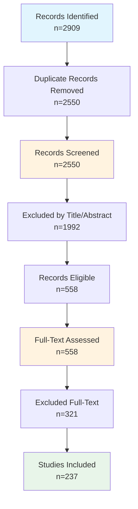

# Systematic Review Findings Report

**Date:** March 04, 2026
**Review Protocol:** PRISMA 2020 Guidelines

---

## Executive Summary

This systematic review identified **237 studies** meeting inclusion criteria. 
The review followed PRISMA 2020 guidelines and covered the period 2018-2026. 
The studies were sourced from WoS, ACM DL, IEEE Xplore, PubMed, arXiv, focusing on blockchain-enabled provenance for scientific data management.

---

## 1. PRISMA Flow Diagram

### 1.1 Flow Statistics

| Stage | Count | Percentage |
|-------|-------|------------|
| Records identified | 2909 | 100% |
| After duplicates removed | 2550 | 87.7% |
| Screened | 2550 | 100% |
| Excluded at title/abstract | 1992 | 78.1% |
| Assessed for full-text | 558 | 21.9% |
| Excluded at full-text | 321 | 57.5% |
| **Studies included** | **237** | **8.1%** |

### 1.2 Mermaid Flowchart

### 1.3 Exclusion Reasons

| Reason | Count |
|--------|-------|
| Wrong topic (technical implementation) | 260 |
| Wrong topic (domain relevance) | 1564 |
| Opinion piece | 19 |
| Non-research context | 138 |

---

## 2. Methods

### 2.1 Search Strategy

This systematic review searched the following databases: WoS. 
Search strings were developed following PRISMA 2020 guidelines with three concept groups:

- **Concept 1:** Blockchain/DLT (blockchain, distributed ledger, smart contract, DLT)
- **Concept 2:** Provenance (provenance, data lineage, chain of custody, verification)
- **Concept 3:** Scientific Data (scientific data, research data, data management, FAIR)

### 2.2 Eligibility Criteria

| Criterion | Description |
|-----------|-------------|
| Language | English |
| Publication type | Journal articles, conference papers, preprints |
| Date range | 2018-2026 |
| Topic | Blockchain/DLT for scientific data provenance |
| Domain | Research data management, data sharing, reproducibility |

### 2.3 Screening Process

1. Records imported from databases and duplicates removed
2. Title and abstract screening using automated keyword-based eligibility criteria
3. Full-text assessment for all included records
4. Data extraction for included studies
5. Quality assessment using Mixed Methods Appraisal Tool (MMAT)

### 2.4 Data Extraction

Extracted variables include: Research focus, Blockchain platform, Provenance model, maDMP support, Evaluation method, Storage integration, Permission model.

### 2.5 Quality Assessment

Quality was assessed using the MMAT with five criteria: Clear research questions, Appropriate methodology, Rigorous data collection, Sound analysis, and Well-supported conclusions.

---

## 3. Study Characteristics

### 3.1 Distribution by Research Focus (n=237)

| Research Focus | Count |
|------------|------|
| Blockchain | 93 |
| Blockchain; Provenance | 33 |
| Other | 91 |
| Provenance | 20 |

### 3.2 Distribution by Blockchain Platform

| Platform | Count |
|------------|------|
| Ethereum | 7 |
| Fabric | 2 |
| Fabric; Hyperledger | 1 |
| Multi-chain | 2 |
| Not specified | 225 |

### 3.3 Distribution by Provenance Model

| Model | Count |
|------------|------|
| Custom | 13 |
| None | 200 |
| OPM | 23 |
| OPM; Custom | 1 |

### 3.4 Distribution by maDMP Support

| maDMP Support | Count |
|------------|------|
| None | 237 |

### 3.5 Distribution by Evaluation Method

| Evaluation Method | Count |
|------------|------|
| Case study | 3 |
| Experiment | 32 |
| Experiment; User study | 1 |
| Not clear | 193 |
| Proof of concept | 2 |
| User study | 6 |

### 3.6 Publication Year Distribution

| Year | Count |
|------------|------|
| 2018 | 14 |
| 2019 | 20 |
| 2020 | 23 |
| 2021 | 18 |
| 2022 | 29 |
| 2023 | 18 |
| 2024 | 30 |
| 2025 | 66 |
| 2026 | 19 |

---

## 4. Detailed Analysis

### 4.1 Top Publication Sources (Journals/Conferences)

| Source | Count |
|--------|-------|
| arXiv | 49 |
| ACM Trans. Storage | 7 |
| IEEE ACCESS | 5 |
| Proceedings of the International Conference for High Performance Computing Networking Storage and Analysis | 5 |
| Proceedings of the SC '23 Workshops of the International Conference on High Performance Computing Network Storage and Analysis | 5 |
| Proceedings of the SC '24 Workshops of the International Conference on High Performance Computing Network Storage and Analysis | 4 |
| ELECTRONICS | 3 |
| Proceedings of the SC '25 Workshops of the International Conference for High Performance Computing Networking Storage and Analysis | 3 |
| ACM Trans. Sen. Netw. | 2 |
| APPLIED SCIENCES-BASEL | 2 |

### 4.2 Storage Integration Patterns

| Storage Type | Count |
|------------|------|
| External DB | 12 |
| IPFS + blockchain | 6 |
| IPFS + blockchain; External DB; Hybrid | 1 |
| Not specified | 218 |

### 4.3 Permission Model Distribution

| Permission Model | Count |
|------------|------|
| Hybrid | 9 |
| Not specified | 213 |
| Permissioned | 1 |
| Permissionless | 13 |
| Permissionless; Hybrid | 1 |

### 4.4 Cross-Tabulation: Blockchain Platform × Provenance Model

| Platform | 
Custom | None | OPM | OPM; Custom
 |
|----------|
---|---|---|---
|
| Ethereum | 1 | 5 | 1 | 0 |
| Fabric | 0 | 2 | 0 | 0 |
| Fabric; Hyperledger | 0 | 1 | 0 | 0 |
| Multi-chain | 1 | 1 | 0 | 0 |
| Not specified | 11 | 191 | 22 | 1 |

### 4.5 Systems/Frameworks Identified

| System/Framework | Mentions |
|------------------|----------|
| Provenance | 51 |
| Ethereum | 2 |
| Ethereum, Provenance | 1 |
| IPFS | 1 |
| Provenance, IPFS | 1 |
| NA | NA |
| NA | NA |
| NA | NA |
| NA | NA |
| NA | NA |

---

## 5. Quality Assessment

### 5.1 Quality Ratings Distribution

| Rating | Count |
|------------|------|
| Medium | 237 |

### 5.2 MMAT Item Scores

| MMAT Item | Yes | Can't tell | Rate |
|-----------|-----|------------|------|
| Clear Research Questions | 3 | 234 | 1.3% |
| Appropriate Methodology | 141 | 96 | 59.5% |
| Rigorous Data Collection | 0 | 237 | 0% |
| Sound Analysis | 147 | 90 | 62% |
| Well-supported Conclusions | 0 | 237 | 0% |

**Mean Quality Score:** 0.62 / 5.0

---

## 6. Thematic Synthesis

### 6.1 Research Themes Identified

| Theme | Description | Studies |
|-------|-------------|---------|
| Blockchain Infrastructure | Papers focusing on blockchain platforms, DLT architecture | 
126
 |
| Provenance Tracking | Papers on data lineage, verification, chain of custody | 
53
 |
| maDMP | Papers on machine-actionable data management plans | 
0
 |
| Combined Approach | Papers addressing multiple themes | 
33
 |

### 6.2 Technical Architecture Patterns

| Pattern | Description | Count |
|---------|-------------|-------|
| Permissioned Blockchain | Systems using Hyperledger Fabric/Iroha | 
3
 |
| Permissionless Blockchain | Systems using Ethereum/public chains | 
7
 |
| PROV-O Based | Systems using W3C PROV ontology | 
0
 |
| Custom Provenance | Systems with proprietary provenance models | 
14
 |

---

## 6. Included Studies

| Study_ID | Title | Year | Authors | Source | Research_Focus | Blockchain_Platform | Provenance_Model | maDMP_Support | Evaluation_Method |
| --- | --- | --- | --- | --- | --- | --- | --- | --- | --- |
| REV001 | The Approach to Managing Provenance M... | 2018 | Demichev Andrey and Kryukov Alexander... | 2018 IVANNIKOV ISPRAS OPEN CONFERENCE... | Provenance | Not specified | None | None | Not clear |
| REV002 | A Decentralized System for Medical Da... | 2020 | Yang Qingzhu and Liu Qiao and Lv Hair... | JOURNAL OF INTERNET TECHNOLOGY | Blockchain | Not specified | None | None | Not clear |
| REV003 | A blockchain-based platform architect... | 2021 | Liu Yue and Lu Qinghua and Zhu Chunsh... | MULTIMEDIA TOOLS AND APPLICATIONS | Blockchain | Not specified | None | None | Not clear |
| REV004 | PROV-IO+: A Cross-Platform Provenance... | 2024 | Han Runzhou and Zheng Mai and Byna Su... | IEEE TRANSACTIONS ON PARALLEL AND DIS... | Provenance | Not specified | None | None | Not clear |
| REV005 | A healthcare data management system: ... | 2025 | Tiwari Kajal and Kumar Sanjay et al. | JOURNAL OF SUPERCOMPUTING | Blockchain | Not specified | None | None | Not clear |
| REV006 | SciLedger: A Blockchain-based Scienti... | 2022 | Hoopes Reagan and Hardy Hamilton and ... | 2022 IEEE 8TH INTERNATIONAL CONFERENC... | Blockchain; Provenance | Not specified | None | None | Not clear |
| REV007 | Proposal of a Blockchain-Based Data M... | 2025 | Park Keundug and Youm Heung-Youl et al. | BIG DATA AND COGNITIVE COMPUTING | Blockchain | Not specified | None | None | Not clear |
| REV008 | Highly Reliable IoT Data Management P... | 2020 | Hasegawa Yuki and Yamamoto Hiroshi et... | 2020 IEEE INTERNATIONAL CONFERENCE ON... | Blockchain | Not specified | None | None | Not clear |
| REV009 | SciBlock: A Blockchain-Based Tamper-P... | 2019 | Fernando Dinuni and Kulshrestha Siddh... | 2019 IEEE 5TH INTERNATIONAL CONFERENC... | Blockchain | Not specified | None | None | Not clear |
| REV010 | Blockchain Based Provenance for Agric... | 2018 | Hua Jing and Wang Xiujuan and Kang Me... | 2018 IEEE INTELLIGENT VEHICLES SYMPOS... | Blockchain; Provenance | Not specified | None | None | Not clear |
| REV011 | Blockchain-based Metadata Protection ... | 2019 | LHutereate Arnaud and Burihabwa Doria... | 2019 IEEE 38TH INTERNATIONAL SYMPOSIU... | Blockchain | Not specified | None | None | Not clear |
| REV012 | Timestamping Metadata Using Blockchai... | 2019 | Kolydas Tassos et al. | METADATA AND SEMANTIC RESEARCH MTSR 2019 | Blockchain | Not specified | None | None | Not clear |
| REV013 | A simulation provenance data manageme... | 2019 | Ma Jin and Lee Sik and Cho Kum Won an... | CLUSTER COMPUTING-THE JOURNAL OF NETW... | Provenance | Not specified | None | None | Not clear |
| REV014 | Towards Eidetic Blockchain Systems wi... | 2020 | Linoy Shlomi and Ray Suprio and Stakh... | 2020 IEEE 36TH INTERNATIONAL CONFEREN... | Blockchain; Provenance | Not specified | None | None | Not clear |
| REV015 | A Survey of Blockchain Data Managemen... | 2022 | Wei Qian and Li Bingzhe and Chang Wan... | ACM TRANSACTIONS ON EMBEDDED COMPUTIN... | Blockchain | Not specified | None | None | User study |
| REV016 | A Novel Distributed File System Using... | 2023 | Kumar Deepa S. and Dija S. and Sumith... | WIRELESS PERSONAL COMMUNICATIONS | Blockchain | Not specified | None | None | Not clear |
| REV017 | Metadata Privacy Preservation for Blo... | 2022 | Liu Lixin and Li Xinyu and Man Ho Au ... | DATABASE SYSTEMS FOR ADVANCED APPLICA... | Blockchain | Not specified | None | None | Not clear |
| REV018 | Hybrid On/Off Blockchain Approach for... | 2022 | Validi Aso and Kashansky Vladislav an... | 2022 IEEE 25TH INTERNATIONAL CONFEREN... | Blockchain | Not specified | None | None | Not clear |
| REV019 | Data Provenance for healthcare: a blo... | 2022 | D'Antonio Salvatore and Uccello Feder... | 2022 IEEE 46TH ANNUAL COMPUTERS SOFTW... | Blockchain; Provenance | Not specified | None | None | Not clear |
| REV020 | SmartProvenance: A Distributed Blockc... | 2018 | Ramachandran Aravind and Kantarcioglu... | PROCEEDINGS OF THE EIGHTH ACM CONFERE... | Blockchain; Provenance | Not specified | None | None | Not clear |
| REV021 | BLINKER: A Blockchain-enabled Framewo... | 2019 | Bose R. P. Jagadeesh Chandra and Phok... | 2019 26TH ASIA-PACIFIC SOFTWARE ENGIN... | Blockchain; Provenance | Not specified | None | None | Not clear |
| REV022 | Blockchain-Enabled Fish Provenance an... | 2022 | Wang Xu and Yu Guangsheng and Liu Ren... | IEEE INTERNET OF THINGS JOURNAL | Blockchain; Provenance | Not specified | None | None | Not clear |
| REV023 | A blockchain-based secure framework f... | 2024 | Zorlu Ozan and Ozsoy Adnan et al. | IET COMMUNICATIONS | Blockchain | Not specified | None | None | Not clear |
| REV024 | EduChain: A Blockchain-Based Educatio... | 2021 | Liu Yihan and Li Ke and Huang Zihao a... | BLOCKCHAIN TECHNOLOGY AND APPLICATION... | Blockchain | Not specified | None | None | Not clear |
| REV025 | A Data Management Method Based on Blo... | 2020 | Chen Xiaoyan and Liu Yuliang and Ge J... | 2020 3RD INTERNATIONAL CONFERENCE ON ... | Blockchain | Not specified | None | None | Not clear |
| REV026 | Implementing a Blockchain-Powered Met... | 2023 | Dolhopolov Anton and Castelltort Arna... | BLOCKCHAIN AND APPLICATIONS 5TH INTER... | Blockchain | Not specified | None | None | Not clear |
| REV027 | Data Provenance in the Cloud A blockc... | 2019 | Tosh Deepak and Shetty Sachin and Lia... | IEEE CONSUMER ELECTRONICS MAGAZINE | Blockchain; Provenance | Not specified | None | None | Not clear |
| REV028 | A Blockchain-Based E-Healthcare Syste... | 2024 | Sun Lianshan and Liu Diandong and Li ... | IEEE ACCESS | Blockchain; Provenance | Not specified | None | None | Not clear |
| REV029 | Blockchain-Based Pension System Ensur... | 2023 | Kamal Minhaz and Abdullah Chowdhury M... | IEICE TRANSACTIONS ON INFORMATION AND... | Blockchain; Provenance | Not specified | None | None | Not clear |
| REV030 | Blockchain-based Secure Medical Data ... | 2022 | Wang Meiquan and Zhang Huiru and Wu H... | BSCI'22: PROCEEDINGS OF THE FOURTH AC... | Blockchain | Not specified | None | None | Not clear |
| REV031 | A Blockchain Based Framework for Smar... | 2021 | Guo Chenkai and Zi Yapeng and Ren Wei... | KNOWLEDGE SCIENCE ENGINEERING AND MAN... | Blockchain | Not specified | None | None | Not clear |
| REV032 | An Interactive IoT-Blockchain System ... | 2022 | Al-Zoubi Abdallah and Saadeddin Tariq... | 2022 4TH IEEE MIDDLE EAST AND NORTH A... | Blockchain | Not specified | None | None | Not clear |
| REV033 | Blockchain-based Built Environment Da... | 2024 | Zhang Yaqi and Tryfonas Theo and Carh... | 2024 IEEE INTERNATIONAL SMART CITIES ... | Blockchain | Not specified | None | None | Not clear |
| REV034 | A Blockchain Based Data Management Sy... | 2018 | Chen Mengjie and Li Yuexuan and Xu Zh... | SMART BLOCKCHAIN | Blockchain | Not specified | None | None | Not clear |
| REV035 | HealthBlock: A secure blockchain-base... | 2021 | Zaabar Bessem and Cheikhrouhou Omar a... | COMPUTER NETWORKS | Blockchain | Not specified | None | None | Not clear |
| REV036 | Efficient Metadata Indexing for HPC S... | 2020 | Paul Arnab K. and Wang Brian and Rutm... | 2020 20TH IEEE/ACM INTERNATIONAL SYMP... | Other | Not specified | None | None | Not clear |
| REV037 | IoT Big Data provenance scheme using ... | 2021 | Pajooh Houshyar Honar and Rashid Moha... | JOURNAL OF BIG DATA | Blockchain; Provenance | Not specified | None | None | Not clear |
| REV038 | ProductChain: Scalable Blockchain Fra... | 2018 | Malik Sidra and Kanhere Salil S. and ... | 2018 IEEE 17TH INTERNATIONAL SYMPOSIU... | Blockchain; Provenance | Not specified | None | None | Not clear |
| REV039 | An Integrated Blockchain Approach for... | 2020 | Zayas Javier Ramirez and O'Neill Edua... | 2020 IEEE AEROSPACE CONFERENCE (AEROC... | Blockchain; Provenance | Not specified | OPM | None | Not clear |
| REV040 | M2MHub: A Blockchain-based Approach f... | 2019 | Saguil Darren and Xue Qiao and Mahmou... | 2019 IEEE/ACS 16TH INTERNATIONAL CONF... | Blockchain; Provenance | Not specified | None | None | Not clear |
| REV041 | Blockchain for healthcare data manage... | 2022 | Yaqoob Ibrar and Salah Khaled and Jay... | NEURAL COMPUTING \& APPLICATIONS | Blockchain | Not specified | None | None | Not clear |
| REV042 | A Blockchain-based data management ap... | 2025 | Imeri Adnan and Gharsallaoui Oussama ... | 2025 12TH IFIP INTERNATIONAL CONFEREN... | Blockchain | Not specified | None | None | Not clear |
| REV043 | Design of personnel big data manageme... | 2019 | Chen Jian and Lv Zhihan and Song Houb... | FUTURE GENERATION COMPUTER SYSTEMS-TH... | Blockchain | Not specified | OPM | None | Not clear |
| REV044 | A Framework for Secure Healthcare Dat... | 2021 | Taloba I Ahmed and Rayan Alanazi and ... | INTERNATIONAL JOURNAL OF ADVANCED COM... | Blockchain | Not specified | None | None | Not clear |
| REV045 | FogChainFlow: On-off blockchain data ... | 2025 | Karthikeyan P. and Brindha K. et al. | CLUSTER COMPUTING-THE JOURNAL OF NETW... | Blockchain | Not specified | None | None | Not clear |
| REV046 | Trusted Data Management for E-learnin... | 2021 | Cao Chenglong and Zhu Xiaoling et al. | 2021 IEEE 13TH INTERNATIONAL CONFEREN... | Blockchain | Not specified | None | None | Not clear |
| REV047 | Design and Implementation of a Metada... | 2022 | Di Felice Paolino and Paolone Gaetani... | ELECTRONICS | Other | Not specified | None | None | Not clear |
| REV048 | Metadata Model Construction and Annot... | 2024 | Lim Eunchae and Kim Changyeong and Li... | FLEXIBLE AUTOMATION AND INTELLIGENT M... | Other | Not specified | None | None | Not clear |
| REV049 | A Decentralized Approach for Resource... | 2022 | Murturi Ilir and Dustdar Schahram et al. | IEEE TRANSACTIONS ON SERVICES COMPUTING | Other | Not specified | None | None | Not clear |
| REV050 | Protecting metadata privacy in blockc... | 2025 | Saeidi Saeid Tousi and Shahriari Hami... | JOURNAL OF INFORMATION SECURITY AND A... | Blockchain | Not specified | None | None | Not clear |
| REV051 | Exploring the Benefits of Blockchain-... | 2024 | Dolhopolov Anton and Castelltort Arna... | MANAGEMENT OF DIGITAL ECOSYSTEMS MEDE... | Blockchain | Not specified | None | None | Not clear |
| REV052 | CoPS - Cooperative Provenance System ... | 2018 | Gouru Navya and Vadlamani NagaLakshmi... | INTERNATIONAL JOURNAL OF DISTRIBUTED ... | Blockchain; Provenance | Ethereum | None | None | Not clear |
| REV053 | ForensiBlock: A Provenance-Driven Blo... | 2023 | Akbarfam Asma Jodeiri and Heidaripour... | 2023 5TH IEEE INTERNATIONAL CONFERENC... | Blockchain; Provenance | Not specified | None | None | Not clear |
| REV054 | Blockchain-Based Research Data Sharin... | 2018 | Shrestha Ajay Kumar and Vassileva Jul... | BLOCKCHAIN - ICBC 2018 | Blockchain | Not specified | None | None | Not clear |
| REV055 | Data Management System based on Block... | 2020 | Yang Chenxue and Sun Zhiguo et al. | 20TH IEEE INTERNATIONAL CONFERENCE ON... | Blockchain | Not specified | None | None | Not clear |
| REV056 | HierChain: A Hierarchical-Blockchain-... | 2024 | Agarwal Vidushi and Pal Sujata et al. | IEEE INTERNET OF THINGS JOURNAL | Blockchain | Not specified | None | None | Not clear |
| REV057 | An Efficient and Metadata-Aware Big D... | 2020 | Jin Rize and Paik Joon-Young and Biad... | DATABASE SYSTEMS FOR ADVANCED APPLICA... | Other | Not specified | None | None | Not clear |
| REV058 | The Case for Learned Provenance Graph... | 2023 | Ding Hailun and Zhai Juan and Deng Do... | PROCEEDINGS OF THE 32ND USENIX SECURI... | Provenance | Not specified | None | None | Not clear |
| REV059 | In-memory Blockchain: Toward Efficien... | 2018 | Al-Mamun Abdullah and Li Tonglin and ... | 2018 IEEE INTERNATIONAL CONFERENCE ON... | Blockchain; Provenance | Not specified | None | None | Not clear |
| REV060 | A Framework for Data Provenance Assur... | 2024 | Narayan D. G. and Rashmi B. and Pavit... | EAI ENDORSED TRANSACTIONS ON SCALABLE... | Provenance | Not specified | None | None | Not clear |
| REV061 | An Architecture for Attesting to the ... | 2022 | Curty Simon and Fill Hans-Georg and G... | BUSINESS MODELING AND SOFTWARE DESIGN... | Provenance | Not specified | None | None | Not clear |
| REV062 | Tiger Tally: A secure IoT data manage... | 2024 | Zhao Liushun and Guo Deke and Luo Lai... | COMPUTER NETWORKS | Other | Not specified | None | None | Not clear |
| REV063 | Analysis of Data Management in Blockc... | 2019 | Paik Hye-Young and Xu Xiwei and Banda... | IEEE ACCESS | Blockchain | Not specified | None | None | Not clear |
| REV064 | Secure and Transparent Space Explorat... | 2025 | Kim Jaehyun and Cartagena Miguel and ... | APPLIED SCIENCES-BASEL | Other | Not specified | None | None | Not clear |
| REV065 | ISA API: An open platform for interop... | 2021 | Johnson David and Batista Dominique a... | GIGASCIENCE | Other | Not specified | None | None | Experiment |
| REV066 | Globalized Creative Economies: Rethin... | 2025 | Herman Laura et al. | FEMINIST FUTURES OF WORK: Reimagining... | Provenance | Not specified | None | None | Not clear |
| REV067 | Trimma: Trimming Metadata Storage and... | 2024 | Li Yiwei and Tian Boyu and Gao Mingyu... | PROCEEDINGS OF THE 2024 THE INTERNATI... | Other | Not specified | None | None | Not clear |
| REV068 | A Blockchain-Based IoT Data Managemen... | 2019 | Wang Yawei and Wang Chenxu and Luo Xi... | NETWORK AND SYSTEM SECURITY NSS 2019 | Blockchain | Not specified | None | None | Not clear |
| REV069 | Consensus in Data Management With Use... | 2024 | Nawab Faisal and Sadoghi Mohammad et al. | PROCEEDINGS OF THE VLDB ENDOWMENT | Blockchain | Not specified | None | None | Not clear |
| REV070 | A scalable blockchain based framework... | 2024 | Haque Ehtisham Ul and Shah Adil and I... | SCIENTIFIC REPORTS | Blockchain | Not specified | None | None | Not clear |
| REV071 | Blockchain Technology Implementation ... | 2022 | Hira Fariha Anjum and Khalid Haliyana... | TEM JOURNAL-TECHNOLOGY EDUCATION MANA... | Blockchain | Not specified | None | None | Not clear |
| REV072 | Blockchain-Based Privacy-Preserving S... | 2021 | Park Young-Hoon and Kim Yejin and Shi... | ELECTRONICS | Blockchain | Not specified | None | None | Not clear |
| REV073 | A Sensitive Data Management System Ba... | 2025 | Liu Yukun and Zhang Zheng and Zhang J... | 2025 28TH INTERNATIONAL CONFERENCE ON... | Blockchain | Not specified | None | None | Not clear |
| REV074 | BDSP: A Fair Blockchain-enabled Frame... | 2023 | Nguyen Lam D. and Hoang James and Wan... | 2023 IEEE INTERNATIONAL CONFERENCE ON... | Blockchain | Not specified | None | None | Not clear |
| REV075 | Construction of Educational Resource ... | 2022 | Zhang Jingbin and Qi Tianxiang et al. | JOURNAL OF SENSORS | Other | Not specified | None | None | Not clear |
| REV076 | Design and Development of a Provenanc... | 2024 | Gregori Luca and Missier Paolo and St... | 2024 IEEE 40TH INTERNATIONAL CONFEREN... | Provenance | Not specified | OPM | None | Not clear |
| REV077 | Toward a versatile and scalable metad... | 2018 | Billa Eloise and Zertal Soraya and Le... | PROCEEDINGS 2018 INTERNATIONAL CONFER... | Other | Not specified | None | None | Not clear |
| REV078 | A Two Tier Hybrid Metadata Management... | 2022 | Cai Tao and Gao Pengfei and Chen Fuli... | NETWORK AND PARALLEL COMPUTING NPC 2021 | Other | Not specified | None | None | Not clear |
| REV079 | A Blockchain Approach to Ensuring Pro... | 2022 | Sifah Emmanuel Boateng and Xia Qi and... | IEEE SYSTEMS JOURNAL | Blockchain; Provenance | Not specified | None | None | Not clear |
| REV080 | Quine: A Temporal Graph System for Pr... | 2018 | Wright Ryan et al. | PROVENANCE AND ANNOTATION OF DATA AND... | Provenance | Not specified | None | None | Proof of concept |
| REV081 | A secure and extensible blockchain-ba... | 2020 | Sigwart Marten and Borkowski Michael ... | PERSONAL AND UBIQUITOUS COMPUTING | Blockchain; Provenance | Not specified | None | None | Not clear |
| REV082 | Blockchain-Based Data Integrity and P... | 2026 | Venugopal Anita and Yogi Kottala Sri ... | ANALYTICAL LETTERS | Blockchain; Provenance | Not specified | None | None | Not clear |
| REV083 | Trusted Blockchain-Based Signcryption... | 2022 | Su Jinqi and Ren Runtao and Li Yingha... | WIRELESS COMMUNICATIONS \& MOBILE COM... | Blockchain | Not specified | None | None | Not clear |
| REV084 | Intelligent Data Management System an... | 2021 | Han Jing et al. | PROCEEDINGS OF THE 2021 FIFTH INTERNA... | Blockchain | Not specified | None | None | Not clear |
| REV085 | Blockchain technology for efficient d... | 2022 | Singh Suruchi and Sharma Satish Kumar... | MATERIALS TODAY-PROCEEDINGS | Blockchain | Not specified | None | None | Not clear |
| REV086 | The systematic assessment of complete... | 2025 | Huang Yu-Ning and Jaiswal Pooja Vinod... | GENOME BIOLOGY | Other | Not specified | None | None | Not clear |
| REV087 | Semantic data sharing and pricing in ... | 2025 | Sitharamulu V. and Sucharitha G. and ... | DISCOVER COMPUTING | Blockchain | Not specified | None | None | Not clear |
| REV088 | Secure and Provenance Enhanced Intern... | 2020 | Rahman Mohamed Abdur and Hossain M. S... | IEEE ACCESS | Provenance | Not specified | None | None | Not clear |
| REV089 | User Acceptance of Usable Blockchain-... | 2019 | Shrestha Ajay Kumar and Vassileva Jul... | 2019 FIRST IEEE INTERNATIONAL CONFERE... | Blockchain | Not specified | None | None | Not clear |
| REV090 | ProML: A Decentralised Platform for P... | 2022 | Nguyen Khoi Tran and Sabir Bushra and... | SOFTWARE ARCHITECTURE ECSA 2022 | Provenance | Not specified | None | None | Not clear |
| REV091 | A Binary Feature Extraction based Dat... | 2018 | Wang Yangyizhou and Li Lan and Fan Le... | 2018 INTERNATIONAL CONFERENCE ON CYBE... | Provenance | Not specified | None | None | Not clear |
| REV092 | IoT-Blockchain Enabled Optimized Prov... | 2020 | Khan Prince Waqas and Byun Yung-Cheol... | SENSORS | Blockchain; Provenance | Not specified | None | None | Not clear |
| REV093 | Integrating Internet of Things Proven... | 2020 | Markovic Milan and Jacobs Naomi and D... | FRONTIERS IN SUSTAINABLE FOOD SYSTEMS | Blockchain; Provenance | Not specified | None | None | Not clear |
| REV094 | Transforming Healthcare Data Manageme... | 2024 | Samala Agariadne Dwinggo and Rawas So... | INTERNATIONAL JOURNAL OF ONLINE AND B... | Blockchain | Not specified | None | None | Not clear |
| REV095 | Blockchain-Based Data Management Syst... | 2023 | Anggraito Sigit and Parentio Rahman a... | 2023 28TH ASIA PACIFIC CONFERENCE ON ... | Blockchain | Not specified | None | None | Not clear |
| REV096 | A privacy preserving medical data man... | 2025 | Taloba Ahmed I. and Rayan Alanazi et al. | SCIENTIFIC REPORTS | Blockchain | Not specified | None | None | Not clear |
| REV097 | Do Blockchain and IoT Architecture Cr... | 2021 | Mazumdar Somnath and Jensen Thomas an... | PROCEEDINGS OF THE 54TH ANNUAL HAWAII... | Blockchain | Not specified | None | None | Not clear |
| REV098 | On the Design and Implementation of a... | 2022 | Jing Zhengjun and Hu Niuping and Song... | APPLIED SCIENCES-BASEL | Blockchain | Not specified | None | None | Not clear |
| REV099 | A Reliable Data Provenance and Privac... | 2018 | Liang Xueping and Shetty Sachin and T... | INTERNATIONAL JOURNAL OF INFORMATION ... | Provenance | Not specified | None | None | Not clear |
| REV100 | Power global multi-source heterogeneo... | 2025 | Li Jiwei and Li Bo and Liu Shi and Lv... | RESULTS IN ENGINEERING | Other | Not specified | None | None | Not clear |

*... and 137 more studies (see extraction form for complete list)*

---

## 7. Gap Analysis

| Research Gap | Evidence | Studies |
|--------------|----------|---------|
| Fabric x PROV-O | Permissioned blockchain with W3C provenance standard | 0 |
| Fabric x PROV-DM | Fabric with PROV-DM data model | 0 |
| Fabric x OPM | Fabric with Open Provenance Model | 0 |
| Fabric x Custom | No studies found | 0 |
| Iroha x PROV-O | Iroha with W3C provenance standard | 0 |
| Iroha x PROV-DM | No studies found | 0 |
| Iroha x OPM | No studies found | 0 |
| Iroha x Custom | No studies found | 0 |
| Iroha x None | No studies found | 0 |
| Ethereum x PROV-O | Public blockchain with standard provenance | 0 |
| Ethereum x PROV-DM | No studies found | 0 |
| Hyperledger x PROV-O | Hyperledger ecosystem with W3C PROV | 0 |
| Hyperledger x PROV-DM | No studies found | 0 |
| Hyperledger x OPM | No studies found | 0 |
| Hyperledger x Custom | No studies found | 0 |

---

## 8. Key Findings and Implications

### 8.1 Summary of Current State

- The review identified **237 studies** addressing blockchain for scientific data provenance
- Research spans from 2018 to 2026
- Most studies (53.2%) focus on blockchain infrastructure
- Limited integration of formal provenance models (PROV-O)
- Few studies address maDMP specifically

### 8.2 Research Gaps

- Lack of permissioned blockchain solutions for scientific data
- Limited PROV-O implementation for provenance tracking
- Gap in maDMP + blockchain integration
- Need for evaluation studies comparing approaches

---

## 9. Limitations

- **Language restriction:** English publications only
- **Database coverage:** May miss specialized sources
- **Classification based on title/abstract:** May have errors
- **Rapidly evolving field:** Snapshot as of review date
- **Automated extraction:** Key findings require manual verification

---

## 10. Conclusions

This systematic review identified **237 relevant studies** examining blockchain-enabled provenance for scientific data management. 
The literature shows growing interest in blockchain for research data integrity, with a concentration on permissionless platforms. 
However, significant gaps remain in permissioned blockchain solutions, PROV-O integration, and maDMP support. 
This review provides a foundation for understanding the current landscape and identifying opportunities for future research, 
particularly in addressing the reproducibility crisis through cryptographically-secured provenance tracking.

---

*Report generated: March 04, 2026*
*Full extraction data available in: 04_extraction_form.csv*
