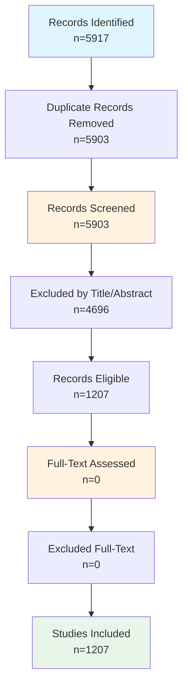

# Systematic Review Findings Report

**Date:** March 04, 2026
**Review Protocol:** PRISMA 2020 Guidelines

---

## Executive Summary

This systematic review identified **1207 studies** meeting inclusion criteria. 
The review followed PRISMA 2020 guidelines and covered the period 2025-2026. 
The studies were sourced from multiple databases, focusing on blockchain-enabled provenance for scientific data management.

---

## 1. PRISMA Flow Diagram

### 1.1 Flow Statistics

| Stage | Count | Percentage |
|-------|-------|------------|
| Records identified | 5917 | 100% |
| After duplicates removed | 5903 | 99.8% |
| Screened | 5903 | 100% |
| Excluded at title/abstract | 4696 | 79.6% |
| Assessed for full-text | 0 | 0% |
| Excluded at full-text | 0 | NaN% |
| **Studies included** | **1207** | **20.4%** |

### 1.2 Mermaid Flowchart

### 1.3 Exclusion Reasons

| Reason | Count |
|--------|-------|
| Wrong topic (technical implementation) | 0 |
| Wrong topic (domain relevance) | 0 |
| Opinion piece | 0 |
| Non-research context | 0 |

---

## 2. Methods

### 2.1 Search Strategy

This systematic review searched the following databases: ACM Digital Library. 
Search strings were developed following PRISMA 2020 guidelines with three concept groups:

- **Concept 1:** Blockchain/DLT (blockchain, distributed ledger, smart contract, DLT)
- **Concept 2:** Provenance (provenance, data lineage, chain of custody, verification)
- **Concept 3:** Scientific Data (scientific data, research data, data management, FAIR)

### 2.2 Eligibility Criteria

| Criterion | Description |
|-----------|-------------|
| Language | English |
| Publication type | Journal articles, conference papers, preprints |
| Date range | 2018-2026 |
| Topic | Blockchain/DLT for scientific data provenance |
| Domain | Research data management, data sharing, reproducibility |

### 2.3 Screening Process

1. Records imported from databases and duplicates removed
2. Title and abstract screening using automated keyword-based eligibility criteria
3. Full-text assessment for all included records
4. Data extraction for included studies
5. Quality assessment using Mixed Methods Appraisal Tool (MMAT)

### 2.4 Data Extraction

Extracted variables include: Research focus, Blockchain platform, Provenance model, maDMP support, Evaluation method, Storage integration, Permission model.

### 2.5 Quality Assessment

Quality was assessed using the MMAT with five criteria: Clear research questions, Appropriate methodology, Rigorous data collection, Sound analysis, and Well-supported conclusions.

---

## 3. Study Characteristics

### 3.1 Distribution by Research Focus (n=50)

| Research Focus | Count |
|------------|------|
| Blockchain | 22 |
| Blockchain; Provenance | 4 |
| Other | 21 |
| Provenance | 3 |

### 3.2 Distribution by Blockchain Platform

| Platform | Count |
|------------|------|
| Ethereum | 3 |
| Ethereum; Hyperledger | 1 |
| Fabric | 1 |
| Fabric; Hyperledger | 1 |
| Not specified | 44 |

### 3.3 Distribution by Provenance Model

| Model | Count |
|------------|------|
| Custom | 3 |
| None | 39 |
| OPM | 7 |
| OPM; Custom | 1 |

### 3.4 Distribution by maDMP Support

| maDMP Support | Count |
|------------|------|
| None | 50 |

### 3.5 Distribution by Evaluation Method

| Evaluation Method | Count |
|------------|------|
| Case study | 1 |
| Experiment | 15 |
| Experiment; Proof of concept | 1 |
| Not clear | 32 |
| Proof of concept | 1 |

### 3.6 Publication Year Distribution

| Year | Count |
|------------|------|
| 2025 | 10 |
| 2026 | 40 |

---

## 4. Detailed Analysis

### 4.1 Top Publication Sources (Journals/Conferences)

| Source | Count |
|--------|-------|
|  | NA |
|  | NA |
|  | NA |
|  | NA |
|  | NA |
|  | NA |
|  | NA |
|  | NA |
|  | NA |
|  | NA |

### 4.2 Storage Integration Patterns

| Storage Type | Count |
|------------|------|
| External DB | 9 |
| IPFS + blockchain | 1 |
| IPFS + blockchain; External DB | 1 |
| Not specified | 39 |

### 4.3 Permission Model Distribution

| Permission Model | Count |
|------------|------|
| Hybrid | 3 |
| Not specified | 41 |
| Permissioned | 1 |
| Permissioned; Hybrid | 1 |
| Permissionless | 3 |
| Permissionless; Hybrid | 1 |

### 4.4 Cross-Tabulation: Blockchain Platform × Provenance Model

| Platform | 
Custom | None | OPM | OPM; Custom
 |
|----------|
---|---|---|---
|
| Ethereum | 0 | 3 | 0 | 0 |
| Ethereum; Hyperledger | 0 | 0 | 0 | 1 |
| Fabric | 1 | 0 | 0 | 0 |
| Fabric; Hyperledger | 0 | 1 | 0 | 0 |
| Not specified | 2 | 35 | 7 | 0 |

### 4.5 Systems/Frameworks Identified

| System/Framework | Mentions |
|------------------|----------|
| Provenance | 7 |
| NA | NA |
| NA | NA |
| NA | NA |
| NA | NA |
| NA | NA |
| NA | NA |
| NA | NA |
| NA | NA |
| NA | NA |

---

## 5. Quality Assessment

### 5.1 Quality Ratings Distribution

| Rating | Count |
|------------|------|
| High | 1 |
| Medium | 49 |

### 5.2 MMAT Item Scores

| MMAT Item | Yes | Can't tell | Rate |
|-----------|-----|------------|------|
| Clear Research Questions | 2 | 48 | 4% |
| Appropriate Methodology | 21 | 29 | 42% |
| Rigorous Data Collection | 0 | 50 | 0% |
| Sound Analysis | 32 | 18 | 64% |
| Well-supported Conclusions | 0 | 50 | 0% |

**Mean Quality Score:** 0.61 / 5.0

---

## 6. Thematic Synthesis

### 6.1 Research Themes Identified

| Theme | Description | Studies |
|-------|-------------|---------|
| Blockchain Infrastructure | Papers focusing on blockchain platforms, DLT architecture | 
26
 |
| Provenance Tracking | Papers on data lineage, verification, chain of custody | 
7
 |
| maDMP | Papers on machine-actionable data management plans | 
0
 |
| Combined Approach | Papers addressing multiple themes | 
4
 |

### 6.2 Technical Architecture Patterns

| Pattern | Description | Count |
|---------|-------------|-------|
| Permissioned Blockchain | Systems using Hyperledger Fabric/Iroha | 
2
 |
| Permissionless Blockchain | Systems using Ethereum/public chains | 
4
 |
| PROV-O Based | Systems using W3C PROV ontology | 
0
 |
| Custom Provenance | Systems with proprietary provenance models | 
4
 |

---

## 6. Included Studies

| Study_ID | Title | Year | Authors | Source | Research_Focus | Blockchain_Platform | Provenance_Model | maDMP_Support | Evaluation_Method |
| --- | --- | --- | --- | --- | --- | --- | --- | --- | --- |
| REV001 | Blockchain for e-healthcare: a review... | 2026 | Khan et al. | - | Blockchain | Ethereum; Hyperledger | OPM; Custom | None | Not clear |
| REV002 | Identification of biomedical entities... | 2026 | Kaier et al. | - | Other | Not specified | OPM | None | Not clear |
| REV003 | Reconstruction of the Age of Provenan... | 2026 | Chefranova et al. | - | Provenance | Not specified | None | None | Not clear |
| REV004 | A blockchain-based healthcare archite... | 2026 | T F et al. | - | Blockchain | Not specified | None | None | Experiment |
| REV005 | Ag aerogel/ZIF-8 nanocomposite as a s... | 2026 | Xue et al. | - | Other | Not specified | None | None | Not clear |
| REV006 | Long-Term Field Experiments Overview ... | 2026 | Dönmez et al. | - | Other | Not specified | None | None | Experiment; Proof of concept |
| REV007 | BLOCKCHAIN AND AI IN ART PROVENANCE T... | 2026 | Arsalwad et al. | - | Blockchain; Provenance | Not specified | None | None | Experiment |
| REV008 | Deterministic protein structure and b... | 2026 | Kanu et al. | - | Blockchain | Not specified | None | None | Not clear |
| REV009 | BMSES: Blockchain and mobile edge com... | 2026 | Hasan et al. | - | Blockchain | Not specified | None | None | Experiment |
| REV010 | PanGeneWhale - A dockerized Kotlin-ba... | 2026 | Gomes Netto et al. | - | Other | Not specified | OPM | None | Experiment |
| REV011 | Analysis of Web3 Platform Data Manage... | 2026 | Shi et al. | - | Other | Not specified | None | None | Not clear |
| REV012 | Fair Consensus in Blockchain-Dual Sam... | 2026 | Vijaya Vardan Reddy et al. | - | Blockchain | Not specified | None | None | Not clear |
| REV013 | VirJenDB: a FAIR (meta)data and bioin... | 2026 | Saghaei et al. | - | Other | Not specified | OPM | None | Not clear |
| REV014 | A Provenance Chain for Decentralized ... | 2026 | Reif et al. | - | Provenance | Not specified | None | None | Not clear |
| REV015 | Neurosynth Compose: A web-based platf... | 2026 | Kent et al. | - | Other | Not specified | None | None | Not clear |
| REV016 | SAHChain: A Hybrid Storage Blockchain... | 2026 | Qin et al. | - | Blockchain | Ethereum | None | None | Not clear |
| REV017 | Enabling metadata enrichment of 3D me... | 2026 | Geiger et al. | - | Other | Not specified | None | None | Not clear |
| REV018 | Bridging the Data Discovery Gap: User... | 2026 | Wu et al. | - | Other | Not specified | None | None | Not clear |
| REV019 | Verification and Analysis of Phase Ad... | 2026 | B.; Feng et al. | - | Other | Not specified | None | None | Not clear |
| REV020 | How User-Generated Content and Platfo... | 2026 | Lo et al. | - | Other | Not specified | None | None | Not clear |
| REV021 | The agnostics way platform for data g... | 2026 | Patil et al. | - | Other | Not specified | None | None | Experiment |
| REV022 | Blockchain-Based Data Integrity and P... | 2026 | Venugopal et al. | - | Blockchain; Provenance | Not specified | None | None | Not clear |
| REV023 | VeriCert: SSL/TLS Certificate Verific... | 2026 | Giuliani et al. | - | Blockchain | Not specified | None | None | Experiment |
| REV024 | RedactChain: A Redactable Blockchain-... | 2026 | Sharma et al. | - | Blockchain | Not specified | Custom | None | Not clear |
| REV025 | A Comprehensive Analysis of Intellige... | 2026 | Jain et al. | - | Blockchain | Not specified | None | None | Not clear |
| REV026 | Leveraging AI and Blockchain Technolo... | 2026 | Kulkarni et al. | - | Blockchain | Not specified | OPM | None | Not clear |
| REV027 | Blockchain-Enhanced KYC: A Secure and... | 2026 | Sambare et al. | - | Blockchain | Not specified | Custom | None | Not clear |
| REV028 | The Evolution of Patient Data Managem... | 2026 | Sharma et al. | - | Blockchain | Not specified | None | None | Not clear |
| REV029 | A Blockchain-Based Efficient Verifica... | 2026 | Bao et al. | - | Blockchain | Not specified | None | None | Experiment |
| REV030 | Linking SysMLv2 with Systems Platform... | 2026 | Strobbe et al. | - | Other | Not specified | OPM | None | Not clear |
| REV031 | Blockchain Driven Generative AI: Ensu... | 2026 | Alam et al. | - | Blockchain; Provenance | Not specified | None | None | Not clear |
| REV032 | A Blockchain-Enabled Secure and Scala... | 2026 | Patil et al. | - | Blockchain | Fabric; Hyperledger | None | None | Not clear |
| REV033 | A Self-sovereign Identity Framework U... | 2026 | Garrido-Fúnez et al. | - | Blockchain | Not specified | None | None | Not clear |
| REV034 | Byzantine-resistant model verificatio... | 2026 | Dai et al. | - | Other | Not specified | None | None | Experiment |
| REV035 | SD-ATD: Semantic-Decoupling Contrasti... | 2026 | Guo et al. | - | Blockchain | Not specified | None | None | Experiment |
| REV036 | Semantic-driven seasonal data classif... | 2026 | Yuan et al. | - | Other | Not specified | None | None | Experiment |
| REV037 | An Empirical Study of Variation of Bl... | 2026 | Biswas et al. | - | Blockchain | Ethereum | None | None | Not clear |
| REV038 | Fine-scale provenance variability dur... | 2026 | Kang et al. | - | Provenance | Not specified | OPM | None | Not clear |
| REV039 | Decentralized Research Data Sharing M... | 2026 | Hylli et al. | - | Blockchain | Not specified | None | None | Proof of concept |
| REV040 | BarBeR - Barcode Benchmark Repository... | 2026 | Vezzali et al. | - | Other | Not specified | None | None | Experiment |
| REV041 | Decentralized Blockchain Framework fo... | 2025 | Maksymyuk et al. | - | Blockchain; Provenance | Not specified | None | None | Not clear |
| REV042 | The BigFAIR Architecture: Enabling Bi... | 2025 | Castro et al. | - | Other | Not specified | OPM | None | Case study |
| REV043 | Verification and reproducible curatio... | 2025 | Smith et al. | - | Other | Not specified | None | None | Experiment |
| REV044 | Semantic-communication-based two-phot... | 2025 | Li et al. | - | Other | Not specified | None | None | Experiment |
| REV045 | A Lightweight Decentralized Medical D... | 2025 | Zhang et al. | - | Other | Not specified | None | None | Experiment |
| REV046 | A Blockchain-based System for Dataset... | 2025 | Galletta et al. | - | Blockchain | Not specified | None | None | Experiment |
| REV047 | OpenIDS2: A low-cost, 3D-printed, ope... | 2025 | Kim et al. | - | Other | Fabric | Custom | None | Not clear |
| REV048 | A privacy preserving medical data man... | 2025 | Taloba et al. | - | Blockchain | Not specified | None | None | Not clear |
| REV049 | EmbryoTrust: A Blockchain-Based Frame... | 2025 | Alsalamah et al. | - | Blockchain | Ethereum | None | None | Not clear |
| REV050 | Semantic data sharing and pricing in ... | 2025 | Sitharamulu et al. | - | Blockchain | Not specified | None | None | Not clear |

---

## 7. Gap Analysis

| Research Gap | Evidence | Studies |
|--------------|----------|---------|
| Fabric x PROV-O | Permissioned blockchain with W3C provenance standard | 0 |
| Fabric x PROV-DM | Fabric with PROV-DM data model | 0 |
| Fabric x OPM | Fabric with Open Provenance Model | 0 |
| Iroha x PROV-O | Iroha with W3C provenance standard | 0 |
| Iroha x PROV-DM | No studies found | 0 |
| Iroha x OPM | No studies found | 0 |
| Iroha x Custom | No studies found | 0 |
| Iroha x None | No studies found | 0 |
| Ethereum x PROV-O | Public blockchain with standard provenance | 0 |
| Ethereum x PROV-DM | No studies found | 0 |
| Hyperledger x PROV-O | Hyperledger ecosystem with W3C PROV | 0 |
| Hyperledger x PROV-DM | No studies found | 0 |
| BigchainDB x PROV-O | No studies found | 0 |
| BigchainDB x PROV-DM | No studies found | 0 |
| BigchainDB x OPM | No studies found | 0 |

---

## 8. Key Findings and Implications

### 8.1 Summary of Current State

- The review identified **50 studies** addressing blockchain for scientific data provenance
- Research spans from 2025 to 2026
- Most studies (52%) focus on blockchain infrastructure
- Limited integration of formal provenance models (PROV-O)
- Few studies address maDMP specifically

### 8.2 Research Gaps

- Lack of permissioned blockchain solutions for scientific data
- Limited PROV-O implementation for provenance tracking
- Gap in maDMP + blockchain integration
- Need for evaluation studies comparing approaches

---

## 9. Limitations

- **Language restriction:** English publications only
- **Database coverage:** May miss specialized sources
- **Classification based on title/abstract:** May have errors
- **Rapidly evolving field:** Snapshot as of review date
- **Automated extraction:** Key findings require manual verification

---

## 10. Conclusions

This systematic review identified **1207 relevant studies** examining blockchain-enabled provenance for scientific data management. 
The literature shows growing interest in blockchain for research data integrity, with a concentration on permissionless platforms. 
However, significant gaps remain in permissioned blockchain solutions, PROV-O integration, and maDMP support. 
This review provides a foundation for understanding the current landscape and identifying opportunities for future research, 
particularly in addressing the reproducibility crisis through cryptographically-secured provenance tracking.

---

*Report generated: March 04, 2026*
*Full extraction data available in: 04_extraction_form.csv*
